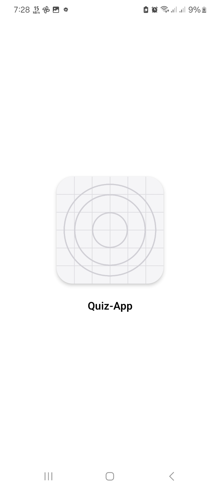
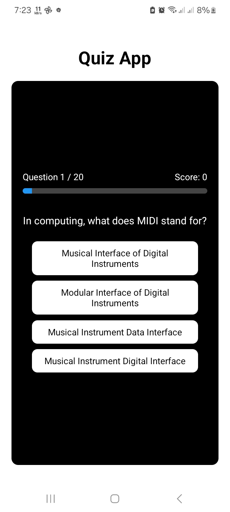
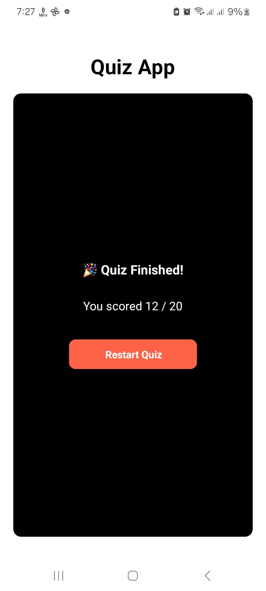

# 📱 Quiz App

A simple multiple-choice **Quiz App** built with **React Native** and **Expo**.  
The app fetches quiz questions from the [Open Trivia Database API](https://opentdb.com/) and includes features like score tracking, progress bar, and restart functionality.

---

## ✨ Features
- ✅ Fetches random quiz questions from Open Trivia DB  
- ✅ Multiple-choice answers with instant feedback  
- ✅ Score counter  
- ✅ Progress bar showing quiz progress  
- ✅ Restart button after finishing the quiz  
- ✅ Works on both **Android** and **iOS** via Expo  

---

## 📸 Screenshots

<p align="center">
  
  
  
</p>


---

## 🚀 Getting Started

### 1. Clone the repo
```bash
git clone https://github.com/ejaymedia/Quiz-App.git
cd Quiz-App
```

### 2. Install dependencies
```bash
npm install
```

### 3. Start the app
```bash
npx expo start
```

- Scan the QR code with **Expo Go** on your Android/iOS device to run the app instantly.  

---

## 📦 Build APK (Optional)
To create a standalone Android app:

```bash
npx eas build -p android --profile preview
```

This will generate an **APK** you can install on your phone.  

---

## 🛠️ Tech Stack
- [React Native](https://reactnative.dev/)  
- [Expo](https://expo.dev/)  
- [Open Trivia DB API](https://opentdb.com/)  

---

## 👤 Author
**Ejay Afolabi**  
- [Instagram](https://instagram.com/call.me_ejay)  
- [WhatsApp](https://wa.me/+2349069183704)  

---

⭐ If you like this project, don’t forget to give it a star on GitHub!
